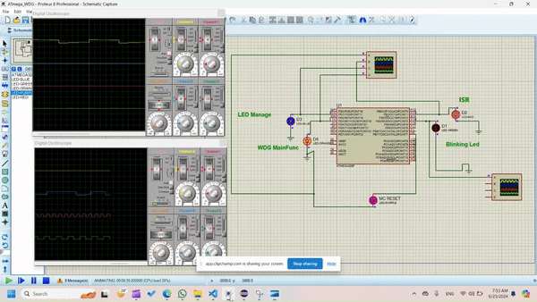

# LED Blinking Project with Watchdog Supervision

## Project Overview

This project involves implementing an LED blinking system with watchdog supervision capability on an ATmega328P microcontroller. The project is divided into several components, each responsible for different aspects of the system. The main components are:

- **LEDMgr** (LED Manager)
- **GPIO** (General Purpose Input/Output)
- **WDGDrv** (Watchdog Driver)
- **WDGM** (Watchdog Manager)

## Components Description
#### GPIO Component
The GPIO component is responsible for handling the pin configuration and control for the LED. It includes the following functions:

- **GPIO_Init**: Initializes GPIO configuration for the pin used to control the LED.
- **GPIO_Write**: Writes a specific value (0 or 1) to the pin.
### LEDMgr Component
The LEDMgr component manages the LED blinking actions using the GPIO_Write function. It includes the following functions:

- **LED_Init**: Initializes the LED component's internal variables.
- **LED_Manage**: Manages the LED blinking actions and is called from a super loop every 10ms. The LED blinking periodicity is 500ms for each stage, managed using the standard Delay function.

### Watchdog Management
The Watchdog management capability is handled through two different components:
- **WDGDrv**: Implements a complete driver for the window watchdog peripheral.
- **WDGM**: Manages the supervision of the LEDMgr component.

#### WDGDrv Component
The WDGDrv component implements a complete driver for the watchdog timer peripheral. It includes the following functions:
- **WDGDrv_Init**: Configures the watchdog driver to support the following features:
  - Sets the maximum timeout value to 64ms.
  - Activates the watchdog.

A timer with an ISR (Interrupt Service Routine) is configured to be called every 50ms. In the timer ISR, the following conditions are checked to refresh the watchdog timer:
1. `WDGM_MainFunction` is not stuck.
2. The `WDGM` state set by `WDGM_MainFunction` is OK.

If both conditions are satisfied, the watchdog timer is refreshed; otherwise, it is left to reset.

#### WDGM Component
The WDGM component provides supervision for the availability of the LEDM software entity. It includes the following functions:

- **WDGM_Init**: Initializes the WDGM internal variables.

- **WDGM_MainFunction**: Checks the number of calls of the `LEDM_MainFunction` within a 100ms period. If the number of calls is between 8 and 12, the status is OK; otherwise, the status is not OK. This function should be called periodically every 20ms.
- **WDGM_ProvideSupervisionStatus**: Provides the status of the LEDMgr entity to the WDGDrv.
- **WDGM_AlivenessIndication**: Should be called from the `LED_Manage` function to detect its call at the correct timing.

## Requirements

1. Source code for the different components.
2. Simulation file for testing.
3. Screen recording of the simulation for the following scenarios:
   - **Positive scenario**: Checks the periodicity of the LED blinking, call of the `LED_Manage`, call of the `WDGM_MainFunction`, and refreshment of the WDGDrv. Timing evidence can be provided by using test pins toggle on the oscilloscope.
   - **note**: before building project ,comment `wdt_enable` in timer.c file.
    
   - **Negative scenario 1**: Comments the call of the `WDGM_MainFunction` and checks that the watchdog reset occurs after 50ms.
     
   - **Negative scenario 2**: Comments the call of the `WDGM_AlivenessIndication` from the `LED_Manage` while the `WDGM_MainFunction` is executed periodically and checks that the watchdog reset occurs after 100ms.
     
   - **Negative scenario 3**: Changes the periodicity of the call of the `LED_Manage` to every 5ms and checks that the watchdog reset occurs after 100ms.
     

